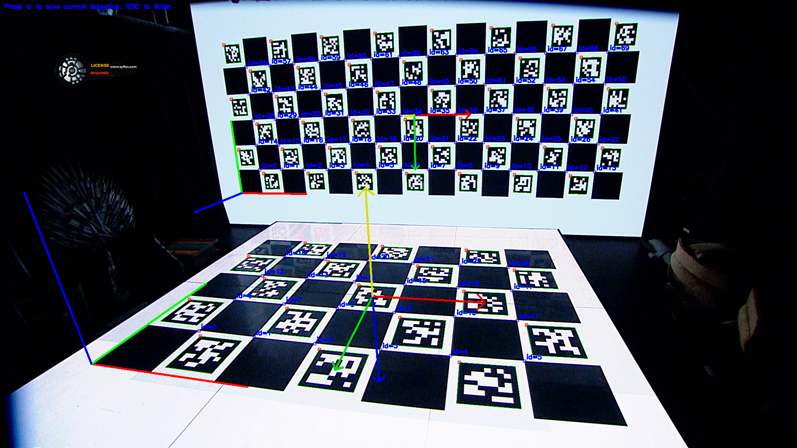
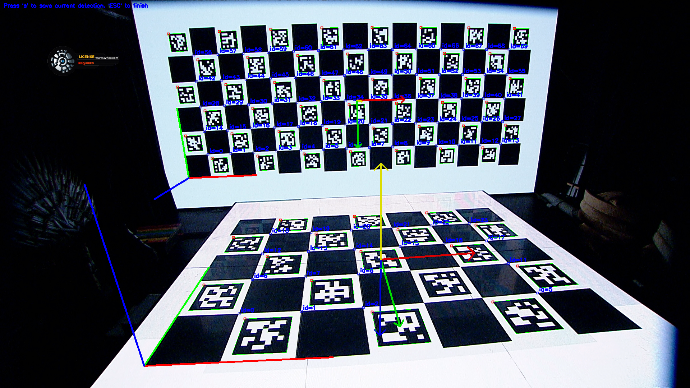
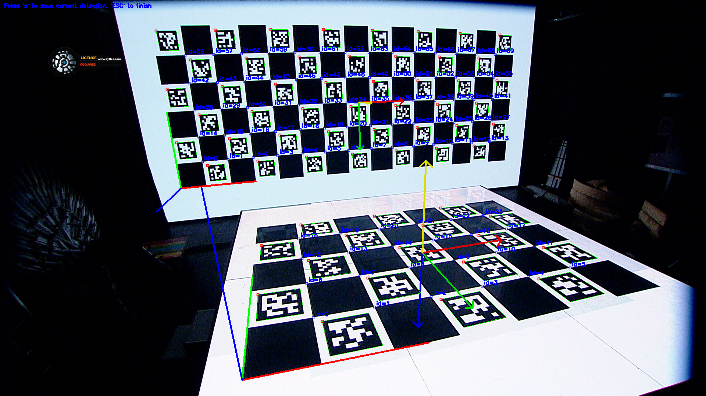
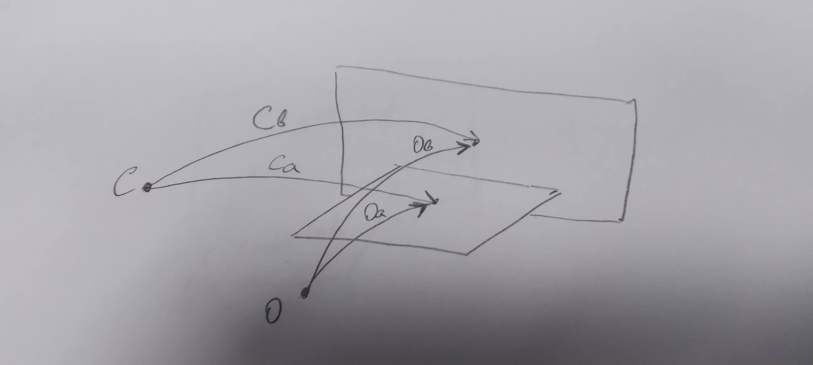

# Calibrating LED screen position

In our Virtual Production Environment we use nDisplay technology for VR studio. After installing LED screens you can use ruler to find exact their positions, but it could be hard enough to find precise values of position and rotation.

To find LED screens position/rotation we will use visual method based on ChArUco board and OpenCV libraries/samples.

LED screens:


## ChArUco board
We will use a slightly modified version of create_board_charuco to create proper patterns for LED display.

Vertical screen generating:
```
create_board_charuco -start=0 -iw=4092 -ih=2112 -d=15 -m=0 -h=6 -w=15 --ml=160 --sl=240 _charuco_V.png

imageSize=[3600 x 1440]
iw=4092, ih=2112, w=246, h=336
```

Horizontal screen generating:
```
create_board_charuco -start=100 -iw=1536 -ih=1536 -d=15 -m=0 -h=5 -w=7 --ml=144 --sl=192 _charuco_H.png

imageSize=[1344 x 960]
iw=1536, ih=1536, w=96, h=288
```

resulting images are:


and


## Estimating boards view
Before trying to capture and run estimating LED screen position process, you need to send generated ChArUco boards to LED screen. After patterns appears on a LED screen, **run detect_aruco_markers.exe** to check, how markers detected:
```
detect_aruco_markers.exe -d=15 -ci=2 -vm=1920x1080@25
```

You need to define ZOOM/FOCUS/IRIS lens state when two screen appears in a camera view and ChArUco markers detected on them:


Sometimes you need to return to previous step and regenerate ChArUco boards images, so they properly recognized

## Calibrating camera
Do not change ZOOM/FOCUS/IRIS lens position before staring that process.

Prepare ChArUco board. I used A3 printed pattern on a plastic and composite plate, PDF generated by Calib.io (see https://calib.io/pages/camera-calibration-pattern-generator )

So, run **calibrate_camera_charuco.exe** and follow recommendation from https://docs.opencv.org/4.x/da/d13/tutorial_aruco_calibration.html :
```
calibrate_camera_charuco.exe -ci=2 -vm=1920x1080@25 -d=4 -sl=0.052 -ml=0.040 -h=5 -w=7 CANON_1
```
Turn/move ChArUco board in multiple frame positions:


and many many more from different angles and different position in view.

After you did tons of snapshots software start calibration process and create calibration file *CANON_1*
```
%YAML:1.0
---
calibration_time: "Wed Nov 24 14:49:11 2021"
image_width: 1920
image_height: 1080
flags: 0
camera_matrix: !!opencv-matrix
rows: 3
cols: 3
dt: d
data: [ 9.0042547760812863e+02, 0., 9.8185538708554407e+02, 0.,
9.0054549793941760e+02, 5.5160959926302291e+02, 0., 0., 1. ]
distortion_coefficients: !!opencv-matrix
rows: 1
cols: 5
dt: d
data: [ -1.3289455971620948e-01, 9.4892443969540496e-02,
-1.8491290681531089e-03, -3.7503182569007247e-04,
-2.6179585259964121e-02 ]
avg_reprojection_error: 2.2690461542666748e-01
```

This file contains Intrinsic and Extrinsic Matrices of lens that will be used in a next step.

## Detecting TWO boards.

At this step we will try to detect two ChArUco patterns on a LED screen. 

Run **detect_two_board_charuco** to check how two boards detected:
```
detect_two_board_charuco.exe ^
    -ci=2 -vm=1920x1080@25 -c=CANON_1.yaml ^
    -startA=100 -dA=15 -hA=5 -wA=7 --mlA=144 --slA=192 --dpiA=256 ^
    -startB=0 -dB=15 -hB=6 -wB=15 --mlB=160 --slB=240 --dpiB=400
```

Resulting is next:






If you see drawn axis:
* left-bottom is ChArUco axis
* central is OpenCV axis
Press **S** key to save result. Software saves origin frame, axis drawn frame and YAML file with two view matrices:
```
%YAML:1.0
---
A: !!opencv-matrix
rows: 4
cols: 4
dt: d
data: [ 9.4231120653837386e-01, -3.3379705403339666e-01,
2.5082199879975564e-02, -1.1903952404835660e+00,
6.9808086490829757e-02, 2.6924549817881427e-01,
9.6053823077008793e-01, 1.0124754408154581e+00,
-3.2737810111961096e-01, -9.0337499878459526e-01,
2.7701478386225170e-01, 5.5133635881312397e+00, 0., 0., 0., 1. ]
B: !!opencv-matrix
rows: 4
cols: 4
dt: d
data: [ 9.4388954602323771e-01, 1.9361761623705356e-02,
3.2969326213144556e-01, 1.1081241118653029e-01,
7.0448439765527199e-02, 9.6350012240215366e-01,
-2.5827220420641034e-01, -2.1789380781614520e+00,
-3.2266010327068662e-01, 2.6700680949717676e-01,
9.0807368723000015e-01, 8.5356792962291408e+00, 0., 0., 0., 1. ]
```
These are two projection matrices for each pattern detected on a LED screens. These files will be used in next step for calculating vertical screen position.

## Calculating LED screen position
Before starting calculating vertical screen position, we need to clarify, what results we have and what is assuming we should.

First, take a look on a drawing:



We have to points: **C** and **O**. Point **C** is a camera position. **Ca** and **Cb** are a LED screens transform calculated on previous step. Point **O** is a center of our virtual environment, so **Oa** and **Ob** are transforms of LED screen from virtual environment center.

Lets write equantions:
```
    Oa * Ca^-1 = Ob * Cb^-1

    Ob = Oa * Ca^-1 * Cb
```
Floor LED screen position is assumed as:
* moved forward 3 meters
* rotated about X with -90 degrees

So transformation matrix for **Oa** is:

https://github.com/max-verem/VR-Align/blob/5cd301d63bf4c0e1bb622d05642bb747fd60da73/Charuco/detect_two_board_data.cpp#L31-L46

This matrix is hardcoded into detect_two_board_data.cpp, so if your reference LED screen has other assumed transformation, you need to update matrix value in source code

So lets start:
```
detect_two_board_data.exe ^
    detect_two_board_charuco_1638106813_000.yaml  ^
    detect_two_board_charuco_1638106813_001.yaml  ^
    detect_two_board_charuco_1638106813_002.yaml  ^
    detect_two_board_charuco_1638106813_003.yaml 
```

Results will looks like:

```
pA=[1, 0, 0, 0;
 0, 0, 1, 0;
 0, -1, 0, 3;
 0, 0, 0, 1]
pos = [ 0.000,  0.000,  3.000] @ {   0.00000',    0.00000',  -90.00000'} [-0.70711,  0.00000,  0.00000,  0.70711]

pB = [ 0.014, -2.196,  7.024] @ {   0.11239',   -0.26451',   -0.67313'} [-0.00587, -0.00231,  0.00097,  0.99998]
pB = [ 0.008, -2.195,  7.021] @ {   0.06717',   -0.21385',   -0.71012'} [-0.00620, -0.00187,  0.00057,  0.99998]
pB = [-0.002, -2.195,  7.023] @ {   0.01004',   -0.14866',   -1.08829'} [-0.00950, -0.00130,  0.00008,  0.99995]
pB = [-0.008, -2.195,  7.027] @ {  -0.00983',   -0.13855',   -1.26054'} [-0.01100, -0.00121, -0.00010,  0.99994]

pBavg(CV) = [ 0.003, -2.195,  7.024] @ {   0.04505',   -0.19129',   -0.93300'} [-0.00814, -0.00167,  0.00038,  0.99997]
pBavg(UE) = [ 7.024,  0.003,  2.195] @ {   0.19132',   -0.93300',    0.04193'} [ 0.00038, -0.00814,  0.00167,  0.99997]
```

Resulting outputs value of vertical (B) LED screen position/rotation in TWO axis systems: first one for OpenCV, second one for UE

So current data in nDisplay config:
```
[scene_node] id="display_front" loc="X=7.0,Y=0.0,Z=2.168"      rot="P=0,Y=0,R=0" parent="cave_origin"
[scene_node] id="display_floor" loc="X=3.0,Y=0.0,Z=0.0"      rot="P=-90,Y=0.0,R=0" parent="cave_origin"
```
Could be updated to:
```
[scene_node] id="display_front" loc="X=7.024,Y=0.004,Z=2.195"      rot="Y=0.19132,R=-0.93300,P=0.04193" parent="cave_origin"
[scene_node] id="display_floor" loc="X=3.0,Y=0.0,Z=0.0" rot="P=-90,Y=0.0,R=0" parent="cave_origin"
```
to be more close to real physical positions
