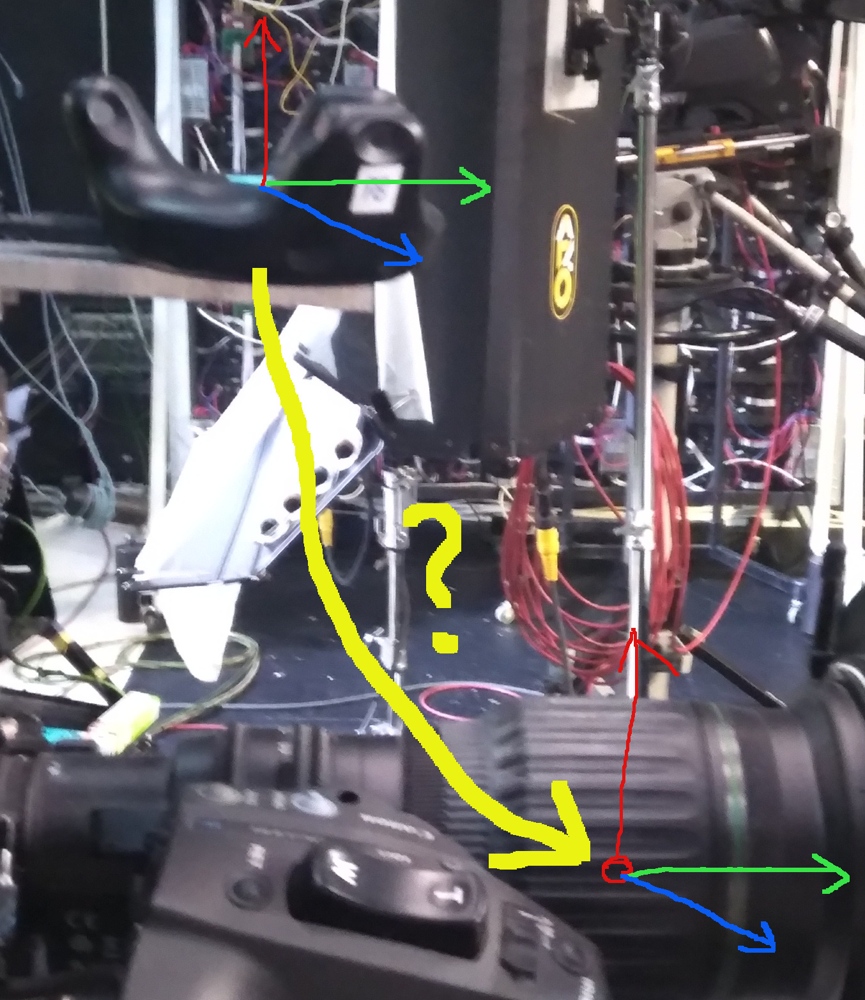
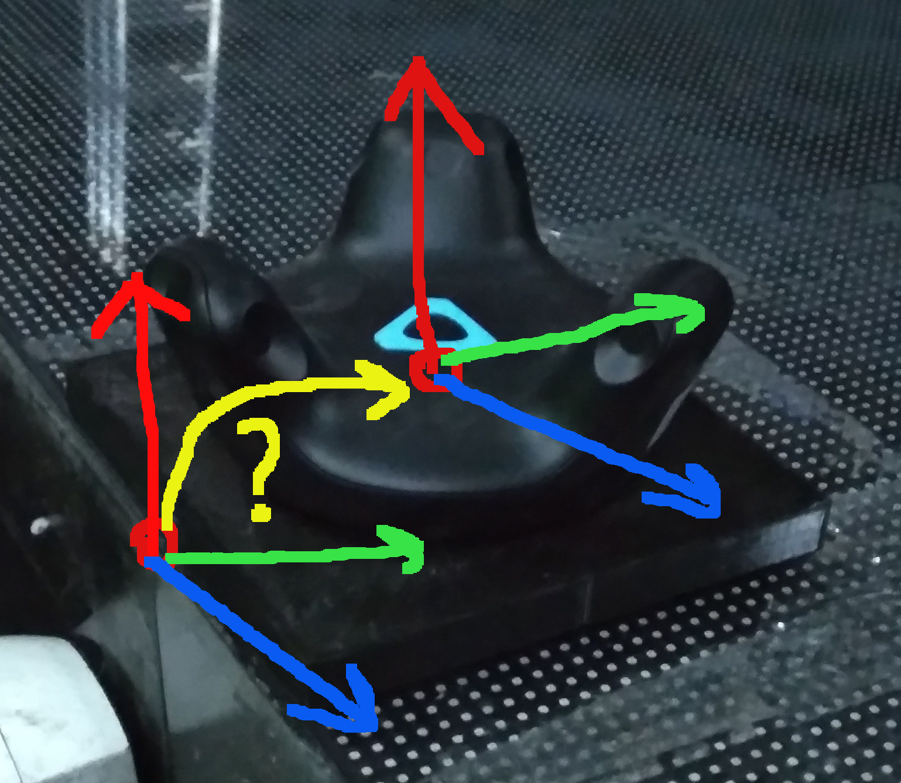
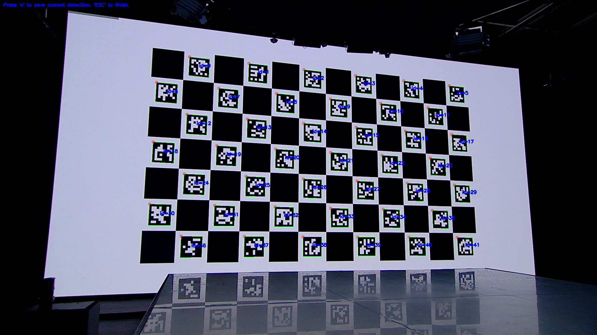
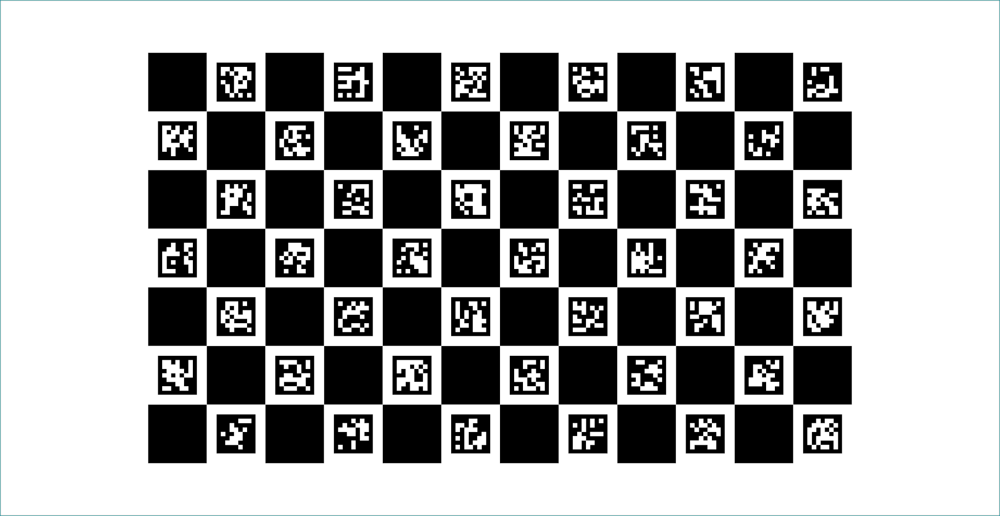
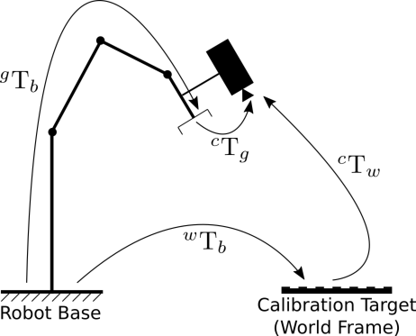

# Calibrating tracker to camera arm

Camera's optical center pose is not same as tracker's pose that mounted on a camera.

There is a translation of position/rotation between them. Arm shown in yellow:



For tracking camera in our Virtual Studio we use TWO trackers: first one mounted on a scene (STK):



another one mounted on a camera. Position of tracker mounted on a camera provided by VRPN server as a relative to mounted on a scene. Calculating camera pose requires two transforms:
* reference (static) tracker to scene
* lens optical center to mounted tracker

We need to find them

## Pattern selection

We will use **create_board_charuco** sample to generate specific ChArUco board that will be used for camera calibrating and camera position detecting.

We need to create several patterns:
```
create_board_charuco -start=0 -iw=4092 -ih=2112 -d=15 -m=0 -h=7 -w=12 --ml=160 --sl=240 charuco_V_01.png
create_board_charuco -start=0 -iw=4092 -ih=2112 -d=15 -m=0 -h=7 -w=7 --ml=160 --sl=240 charuco_V_02.png
create_board_charuco -start=0 -iw=4092 -ih=2112 -d=15 -m=0 -h=6 -w=15 --ml=160 --sl=240 charuco_V_03.png
create_board_charuco -start=0 -iw=4092 -ih=2112 -d=15 -m=0 -h=6 -w=12 --ml=240 --sl=320 charuco_V_04.png
create_board_charuco -start=0 -iw=4092 -ih=2112 -d=15 -m=0 -h=5 -w=12 --ml=240 --sl=320 charuco_V_05.png
```

Estimate with **detect_aruco_markers**:
```
detect_aruco_markers.exe -d=15 -ci=2 -vm=1920x1080@25
```

if board's markers detected in 100% of possible views:

In our case first pattern was ok:


## Getting ChArUco board images

We will use modified version of **detect_aruco_markers** that also could save VRPN trackers data. Create a batch file:
```
detect_aruco_markers.exe ^
    -vrpn-stk=openvr/GenericTracker/LHR-731BED54@10.1.5.83:3885 ^
    -vrpn-mnt=openvr/GenericTracker/LHR-971C5478@10.1.5.83:3885 ^
    -vrpn-cam=virtual/CAMERA-78@10.1.5.83:3885 ^
    -d=15 -ci=2 -vm=1920x1080@25
```

Move camera into different position, press **S** to save frame. 30..40 shots will be enough.

Video snapshots and VRPN trackers information saved into same directory batch file run. In our case we got several files:
```
detect_aruco_markers_1638781725_detect_044.png
[...]
detect_aruco_markers_1638781725_detect_145.png
detect_aruco_markers_1638781725_origin_044.png
[...]
detect_aruco_markers_1638781725_origin_145.png
detect_aruco_markers_1638781725_vrpn_044.yaml 
[...]
detect_aruco_markers_1638781725_vrpn_145.yaml
```

## Calibrating camera

Because of original **calibrate_camera_charuco** does not work with non-zero start image sequence, we have to rename saved images. Copy files:
```
detect_aruco_markers_1638781725_origin_044.png
[...]
detect_aruco_markers_1638781725_origin_145.png
```
to separate folder. Create and put there a batch file:
```
setlocal enabledelayedexpansion
set "count=1"
for /f "delims=*" %%f in ('dir /b /o:-d /tc *.png') do (
    ren %%f img_!count!.png
    set /a count+=1
)
```
run it and check if all files were renamed. They should looks like:
```
img_1.png
img_10.png
img_100.png
img_101.png
img_102.png
img_11.png
[...]
img_98.png
img_99.png
```

Now we can start **calibrate_camera_charuco**  binary:
```
calibrate_camera_charuco.exe ^
    -all -nohint ^
    -v=D:\_manual_date\2021\2021-12-06\1638781725\img_%%d.png ^
    -dpi=400 -d=15 -h=7 -w=12 --ml=160 --sl=240 ^
    1638781725
```
it is a quite long process:
```
[ERROR:0] global /build/opencv/modules/videoio/src/cap_ffmpeg_impl.hpp (1094) open Could not find decoder for codec_id=61
[ERROR:0] global /build/opencv/modules/videoio/src/cap_ffmpeg_impl.hpp (1126) open VIDEOIO/FFMPEG: Failed to initialize VideoCapture
Frame captured: 0
Frame captured: 1
[...]
Frame captured: 101
calibrateCameraAruco.... 0.87612
interpolateCornersCharuco ......................................................................................................
calibrateCameraCharuco.... 0.317121
Rep Error: 0.317121
Rep Error Aruco: 0.87612
Calibration saved to 1638781725
```
Resulting file in YAML format saved to file *1638781725*, it looks like:
```
%YAML:1.0
---
calibration_time: "Wed Dec  8 11:53:53 2021"
image_width: 1920
image_height: 1080
flags: 0
camera_matrix: !!opencv-matrix
   rows: 3
   cols: 3
   dt: d
   data: [ 1.3481136445138848e+03, 0., 9.7469147981008405e+02, 0.,
       1.3482969417041500e+03, 5.5993009182147841e+02, 0., 0., 1. ]
distortion_coefficients: !!opencv-matrix
   rows: 1
   cols: 5
   dt: d
   data: [ -6.6699731715549994e-03, 1.0855901880363467e-01,
       2.2102951542018351e-06, -3.5258499245066139e-04,
       -4.3349823776393029e-02 ]
avg_reprojection_error: 3.1712071459907337e-01
```

## Finding boards position

At this step we will find a board (actually screen) position in a camera space. Start **detect_board_charuco** to find board position:
```
detect_board_charuco.exe  ^
    -img-ses=1638781725 -img-idx=44 -img-path=D:\_manual_date\2021\2021-12-06\charuco\ ^
    -dpi=400 -d=15 -h=7 -w=12 -ml=160 -sl=240 ^
    -c=1638781725.yaml 
```
This version of program will read images from *D:\_manual_date\2021\2021-12-06\charuco\*, that has next pattern:
```
detect_aruco_markers_<session>_origin_<index>.png
```
For each image it creates a YAML file with a pose of board. For example *detect_aruco_markers_1638781725_pose_045.yaml* :
```
%YAML:1.0
---
V_cv: !!opencv-matrix
   rows: 4
   cols: 4
   dt: d
   data: [ 9.1485634749093259e-01, -2.8129549344392873e-01,
       -2.8967345205193684e-01, 5.3531904904653338e-01,
       3.1313847946417767e-01, 9.4718490605494776e-01,
       6.9174029957366046e-02, -1.0605546601158011e-01,
       2.5491597857806381e-01, -1.5399220470470718e-01,
       9.5462256664912948e-01, 8.9454003354338774e+00, 0., 0., 0., 1. ]
```

## Finding ARM

Finding arm is a classical  **Robot-World/Hand-Eye** calibration task:



At glance it is possible to use [cv::calibrateHandEye](https://docs.opencv.org/4.x/d9/d0c/group__calib3d.html#gaebfc1c9f7434196a374c382abf43439b) but for me it was not working. If you decide to do a test that function, you can use test data from [link](https://gist.github.com/max-verem/7900e07a5864baae0f61da60762fa752)

So we have to develop own function for searching that transformation. Lets start:
```
CalibrateTrackers2.exe ^
    --task_find_pos2_criteria 0 ^
    --ses 1638781725 --idx 44 --path D:\_manual_date\2021\2021-12-06\charuco\ ^
    --plane 0.003 -2.195  7.024 -0.00814 -0.00167 0.00038 0.99997
```
Please take note on data
```
    --plane 0.003 -2.195  7.024 -0.00814 -0.00167 0.00038 0.99997
```
that is vertical plane (LED screen) position in OpenCV axis calculated in previous [Calibrating LED screen position](../calibrating-led-screen/README.md) article:
```
pBavg(CV) = [ 0.003, -2.195,  7.024] @ {   0.04505',   -0.19129',   -0.93300'} [-0.00814, -0.00167,  0.00038,  0.99997]
```

CalibrateTrackers2's execution resulting log contains several parts, first it displays arguments:
```
plane = [ 0.003, -2.195,  7.024] @ {   0.04510',   -0.19101',   -0.93286'} [-0.00814, -0.00167,  0.00038,  0.99997]
PLANE=[0.9999941334539358, -0.0007327828629409148, -0.003346055437035523, 0.003;
 0.0007871575630307971, 0.9998671932209989, 0.01627809274247095, -2.195;
 0.003333682750787526, -0.01628063111913362, 0.9998619042696245, 7.024;
 0, 0, 0, 1]
```

Next software start loading yaml files of pose and vrpn datas:
```
Loading: D:\_manual_date\2021\2021-12-06\charuco\\detect_aruco_markers_1638781725_pose_044.yaml... D:\_manual_date\2021\2021-12-06\charuco\\detect_aruco_markers_1638781725_vrpn_044.yaml...  OK
  cam_ue = [-1.386, -2.710,  0.714] @ { -14.89670',    7.41570',   -2.42015'} [-0.01251,  0.06684, -0.12798,  0.98944]
vrpn_cam = [-1.450, -2.670,  0.780] @ { -12.69490',    4.18675',   -2.66753'} [-0.01908,  0.03887, -0.10961,  0.99303]
vrpn_mnt = [ 0.645,  1.382, -1.991] @ {  89.22892',    1.23124',    4.45514'} [ 0.02013,  0.03494,  0.70146,  0.71156]
vrpn_stk = [ 2.959, -0.705, -2.906] @ { 101.79675',   -0.46469',   -0.22052'} [-0.00193,  0.00405, -0.77602, -0.63070]
Loading: D:\_manual_date\2021\2021-12-06\charuco\\detect_aruco_markers_1638781725_pose_045.yaml... D:\_manual_date\2021\2021-12-06\charuco\\detect_aruco_markers_1638781725_vrpn_045.yaml...  OK
  cam_ue = [-1.388, -2.707,  0.705] @ { -16.40518',    3.14067',  -18.22086'} [-0.15280,  0.04936, -0.13653,  0.97754]
vrpn_cam = [-1.448, -2.674,  0.774] @ { -13.92827',    0.57627',  -18.44742'} [-0.15850,  0.02436, -0.11888,  0.97987]
vrpn_mnt = [ 0.595,  1.380, -2.006] @ {  88.63228',   17.41508',    4.30505'} [-0.07913,  0.13418,  0.68601,  0.71072]
vrpn_stk = [ 2.959, -0.705, -2.906] @ { 101.80563',   -0.46236',   -0.21739'} [-0.00193,  0.00402, -0.77606, -0.63064]
```

Next is searching ARM rotation by gradient flow:
```
(Yaw=-0.001000',Roll=0.001000',Pitch=0.001000'), avg=0.030418
	(Yaw=-0.002000',Roll=0.002000',Pitch=0.002000'), avg=0.030405
	(Yaw=-0.003000',Roll=0.003000',Pitch=0.003000'), avg=0.030392
[...]
	(Yaw=-2.123000',Roll=2.741000',Pitch=0.317000'), avg=0.000014
	(Yaw=-2.123000',Roll=2.742000',Pitch=0.317000'), avg=0.000003
	(Yaw=-2.124000',Roll=2.743000',Pitch=0.318000'), avg=0.000003
REF = [ 0.000,  0.000,  0.000] @ {   0.00000',   -0.00000',    0.00000'} [ 0.00000,  0.00000,  0.00000,  1.00000]
ARM = [ 0.000,  0.000,  0.000] @ {  -2.12400',    2.74300',    0.31800'} [ 0.00322,  0.02388, -0.01860,  0.99954]
```
Next is searching for position of arm and reference trackers:
```
Searching for ARM/REF position:
[...]
	0.210384
		ref.xyz = [0.001000, -0.001000, -0.001000]
		arm.xyz = [0.001000, -0.001000, -0.001000]
	0.207491
		ref.xyz = [0.002000, -0.002000, -0.002000]
		arm.xyz = [0.002000, -0.002000, -0.002000]
```
it is fast enough:
```
	0.042684
		ref.xyz = [-0.007000, 0.014000, 0.024000]
		arm.xyz = [0.111000, -0.059000, -0.203000]
REF = [-0.007,  0.014,  0.024] @ {   0.00000',   -0.00000',    0.00000'} [ 0.00000,  0.00000,  0.00000,  1.00000]
ARM = [ 0.111, -0.059, -0.203] @ {  -2.12400',    2.74300',    0.31800'} [ 0.00322,  0.02388, -0.01860,  0.99954]
```
After that values will be found it will be nice to compare how long/avarage distance/rotation of calibrated system (Tracker data + additional translation) against values taken from OpenCV data:
```
Distance analisys:
[0]
    CAM = [-1.386, -2.710,  0.714] @ { -14.89670',    7.41570',   -2.42015'} [-0.01251,  0.06684, -0.12798,  0.98944]
    cam = [-1.441, -2.703,  0.744] @ { -14.85154',    6.85321',   -2.41542'} [-0.01314,  0.06197, -0.12773,  0.98978]
    trk = [-1.576, -2.677,  0.939] @ { -12.69178',    4.10747',   -2.12076'} [-0.01442,  0.03766, -0.10978,  0.99314]
   DIFF = [ 0.055, -0.007, -0.030] @ {  -0.04391',    0.54491',    0.13964'} [ 0.00122,  0.00475, -0.00039,  0.99999]
       d = 0.062535
[...]
[101]
    CAM = [-1.368, -0.079,  0.735] @ {  -0.05624',    5.76151',   -0.08799'} [-0.00074,  0.05026, -0.00045,  0.99874]
    cam = [-1.382, -0.079,  0.743] @ {   0.10348',    5.47615',    0.18872'} [-0.00160, -0.04777, -0.00082, -0.99886]
    trk = [-1.501, -0.016,  0.941] @ {   2.20463',    2.74749',   -0.23610'} [ 0.00252, -0.02393, -0.01928, -0.99952]
   DIFF = [ 0.015, -0.001, -0.008] @ {  -0.13331',    0.28493',   -0.27584'} [ 0.00240, -0.00249,  0.00116, -0.99999]
       d = 0.016663
dmin=0.009040, davg=0.042684, dmax=0.089252
```
As seen average distance from OpenCV data (that found by charuco board) to calculated value is 4 cm that is good result IMHO.

That data:
```
REF = [-0.007,  0.014,  0.024] @ {   0.00000',   -0.00000',    0.00000'} [ 0.00000,  0.00000,  0.00000,  1.00000]
ARM = [ 0.111, -0.059, -0.203] @ {  -2.12400',    2.74300',    0.31800'} [ 0.00322,  0.02388, -0.01860,  0.99954]
```
will be used for VRPN server [VRPN-FreeD-OpenVR](https://github.com/max-verem/VRPN-FreeD-OpenVR)


